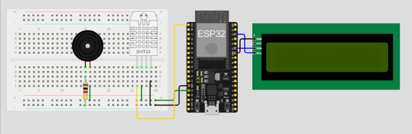
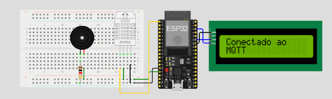
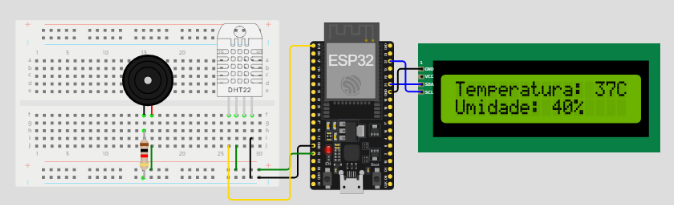
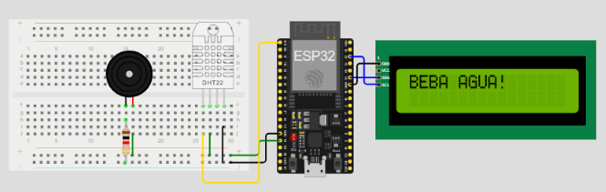
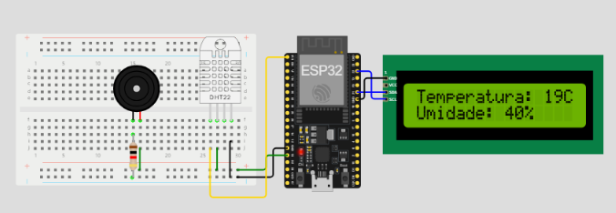
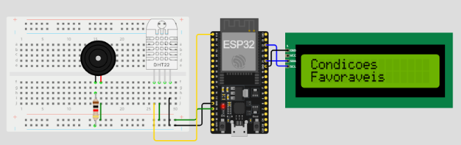
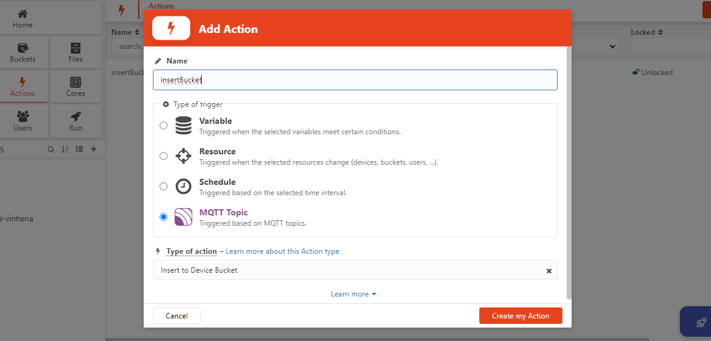
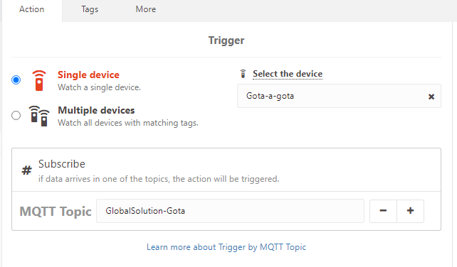

#Sistema de monitoração de temperatura e umidade

## Equipe

|           NOME           |  RM   |
| :----------------------: | :---: |
| Kaiky Alvaro de Miranda  | 98118 |
| Lucas Rodrigues da Silva | 98344 |

---

A gota-a-gota(GG), nada mais é do que um sistema de monitoramento de umidade e temperatura do ambiente, que tem por objetivo a qualidade de vida e saúde das pessoas. Dessa forma, toda vez que a temperatura e a umidade estiverem em condições desfavoráveis e prejudiciais a sáude de uma pessoa, um buzzer é acionado e no LCD aparece a mensagem "Beba Água".

Para acessar o modelo no Wowki [Clique aqui](https://wokwi.com/projects/381852241971423233)

---

# MONTAGEM DO DISPOSITIVO

#### Materias Necessários Para a Montagem do Sistema

|      Componente      | quantidade |                                   Descrição                                   |
| :------------------: | :--------: | :---------------------------------------------------------------------------: |
|      **ESP32**       |     1      |                   Vai se conectar à rede wifi e ao servidor                   |
|     **DHT11/22**     |     1      |         Utilizado para obter as informações de temperatura e umidade          |
|      **Buzzer**      |     1      | Responsável por disparar um alarme quando a as condições não forem favoráveis |
|     **LCD I2C**      |     1      |      Será utilizado para exibir as informações de temperatura e umidade       |
| **Resistor 1K Ohms** |     1      |                             Conexão para o buzzer                             |
| **Placa de Ensaio**  |     1      |                Utilizado como base de conexão dos componentes                 |

### Modelo de Montagem



---

### Funcionamento

O projeto Gota-a-Gota funciona da seguinte forma:
Quando iniciar a compilação do código, ele irá se conectar ao wifi e ao servidor MQTT do Tago.Io



Dessa forma, o sistema está pronto para rodar e testar as condições de ambiente.

Nesse caso, se a temperatura estiver maior qur 35 graus celsius ou umidade menor que 20%

O buzzer será acionado e aparecerá uma mensagem no LCD para que o usuário beba água


Caso contrário, as condições de ambiente estiverem favoráveis.

Aparecerá uma mensagem no LCD informando que as condições estão favoráveis.


---

### Conectando com o Servidor MQTT

Para que o código seja enviado para o servidor MQTT, basta criar um device no TagoIo, pegar o Token de acesso e configurar para que o código se conecte com o servidor.

```JSON
{
    EspMQTTClient client {
    "Wokwi-GUEST",   // SSID do WiFi
    "",              // Senha do WiFi
    "mqtt.tago.io",  // Endereço do servidor MQTT
    "Default",       // Nome de usuário MQTT
    "1da4f76a-8533-446c-969b-e25ad3d84fd0", // Token MQTT
    "Gota-a-gota",   // Porta MQTT
    1883
    };
}
```

Após configurar no código, será preciso que você vai em Actions e adicione um nome, o tipo será MQTT e a action seria "Insert to Device Bucket"

Após isso, basta configurar selecionando o device e colocando o tópico MQTT


---

### Detalhes importantes!
